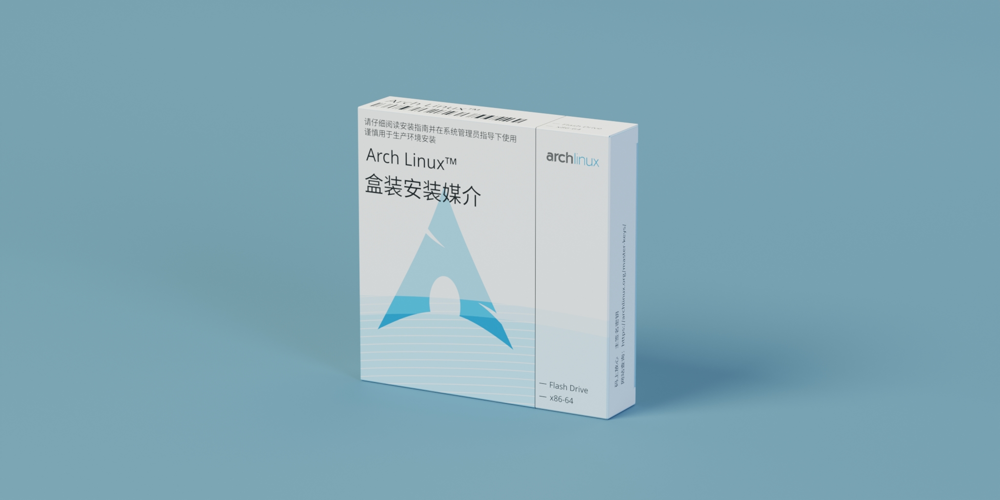

# Arch Linux 盒装安装媒介
这是一个由 [Debian 小药盒](https://github.com/moesoha/debian-media-box) 启发的 Arch Linux 盒装安装介质的平面设计。

尽管 Arch Linux 的 Logo 与某药品并无太多相似之处，但既然已经存在了 Debian 盒装安装介质的梗，那整一个 Arch Linux 盒装安装介质似乎也没问题吧。

## 使用
下载 `box_cmyk.pdf` 文件后打印即可。

## 源文件
`box_source.svg` 为**原始的 InkScape SVG 文件**，`box.svg` 为**全部转换为路径后的 InkScape SVG 文件**。

在这里，由于 InkScape 无法使用 CMYK 色彩模式，因此需要先导入 RGB 色彩模式的 PDF 文件，然后再导入到 Scribus 中转换为 CMYK 色彩模式。

原始的 InkScape SVG 文件中文本并没有转换为路径，因此需要系统上安装有对应的字体。该项目使用的字体有：
- Noto Sans
- Noto Sans CJK SC
- Montserrat
- Inconsolata

## 许可
本作品采用 [CC BY-SA 4.0](https://creativecommons.org/licenses/by-sa/4.0/) 许可协议进行许可。 
